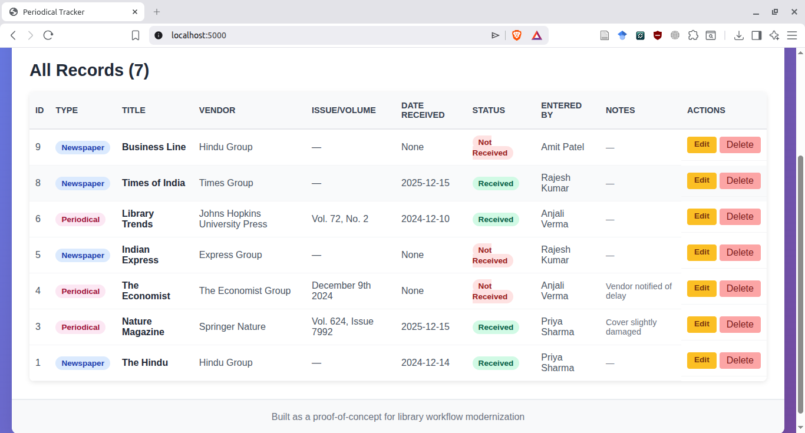
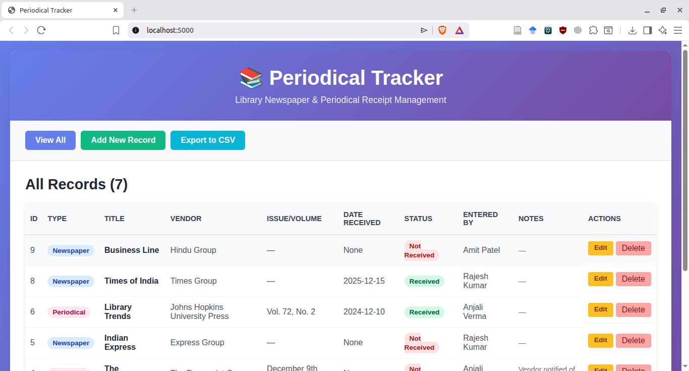
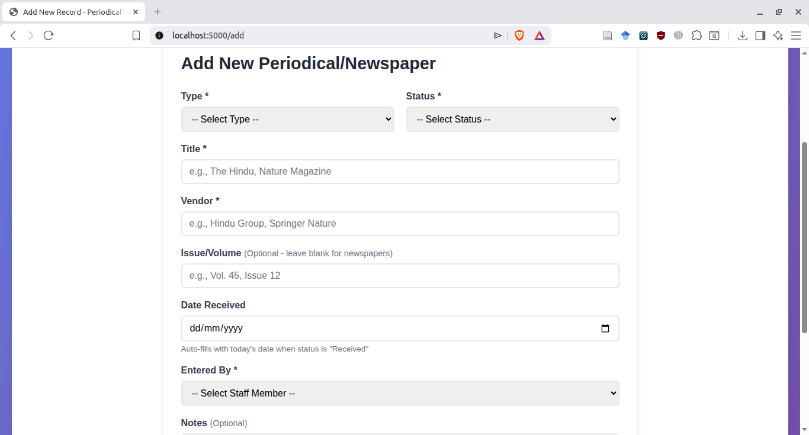
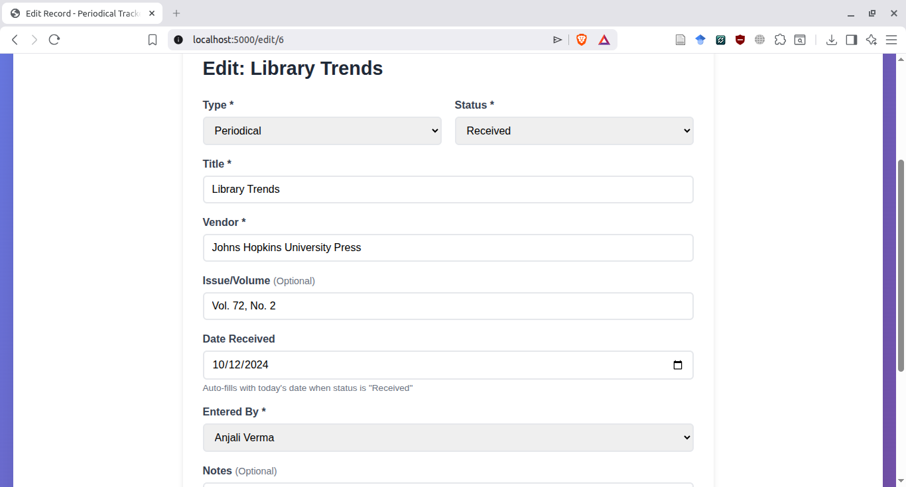

# Periodical Tracker

A web-based application for tracking newspapers and periodicals received by libraries.

## Problem Statement

Many libraries still rely on Excel spreadsheets to track incoming newspapers and periodicals, leading to cluttered sheets where data entry is error-prone and accidental changes are common. A simple web-based application with a SQL database offers a more elegant solution—providing clean data entry forms, preventing accidental edits to existing records, and enabling easy access from mobile devices or tablets for staff working at receiving desks. This proof-of-concept demonstrates how basic web technologies can modernize routine library workflows while maintaining simplicity.

## Quick Start

Want to see it in action? Follow these steps:
```bash
# Clone the repository
git clone https://github.com/sk-negi/periodical-tracker.git
cd periodical-tracker

# Install Flask
pip3 install flask

# Initialize database and add sample data
python3 init_db.py
python3 add_sample_data.py

# Run the application
python3 app.py

# Open in browser: http://localhost:5000
```

That's it! The app will be running with sample library data.

## Features

- View all periodical/newspaper records in chronological order (newest first)
- Clean, intuitive interface with color-coded badges
- Status tracking (Received/Not Received)
- Mobile-friendly responsive design
- SQLite database for reliable data storage

## Tech Stack

- **Backend:** Python 3.10 + Flask
- **Database:** SQLite3
- **Frontend:** HTML5 (Jinja2 templates) + CSS3
- **Export:** CSV

## Data Model

The application tracks the following information for each periodical/newspaper:

- **Type:** Newspaper or Periodical
- **Title:** Name of the publication
- **Vendor:** Supplier/publisher name
- **Issue/Volume:** Issue number or volume (optional, blank for newspapers)
- **Date Received:** Date the item was received (NULL for "Not Received" items)
- **Status:** Received or Not Received
- **Entered By:** Staff member who logged the record
- **Notes:** Optional notes (e.g., "Cover damaged", "Vendor notified")

## Design Decisions

### Date Handling
The "Date Received" field is optional and only populated when status is "Received". This reflects real-world library workflows where items may be logged before arrival (for tracking missing issues) and updated upon receipt.

### Manual Entry vs. Subscriptions
The current implementation uses manual entry for each record. This provides maximum flexibility for tracking irregular items and varying delivery schedules.

## Installation & Setup

1. **Clone the repository:**
```bash
   git clone https://github.com/sk-negi/periodical-tracker.git
   cd periodical-tracker
```

2. **Install dependencies:**
```bash
   pip3 install flask
```

3. **Initialize the database:**
```bash
   python3 init_db.py
```

4. **Add sample data (optional):**
```bash
   python3 add_sample_data.py
```

5. **Run the application:**
```bash
   python3 app.py
```

6. **Open in browser:**
   Navigate to `http://localhost:5000`

## Screenshots

### Homepage - Records Table View


*The main dashboard showing all periodical records with color-coded type badges, status indicators, and action buttons.*

### Navigation and Interface


*Professional UI with intuitive navigation buttons for viewing, adding records, and exporting to CSV.*

### Add New Record Form


*Smart form with conditional fields - date field auto-fills when status is "Received" and hides for "Not Received" items.*

### Edit Record Form


*Edit interface with all fields pre-populated, allowing updates and deletions with confirmation dialogs.*

## Project Status

✅ **COMPLETE** - This proof-of-concept project is fully functional and ready for demonstration.

**Implemented Features:**
- ✅ Database schema with SQLite
- ✅ Sample data generation scripts
- ✅ Flask web application
- ✅ View all records with sortable table
- ✅ Add new records with smart form validation
- ✅ Edit existing records
- ✅ Delete records with confirmation
- ✅ CSV export functionality
- ✅ Responsive, mobile-friendly UI
- ✅ Conditional date field handling
- ✅ Professional documentation with screenshots

## Future Enhancements

If this were to be developed into a production system, the following features would improve efficiency:

- **Subscription Management:** Pre-configure recurring subscriptions with expected delivery schedules
- **Quick Check-in Interface:** Daily checklist view for rapid status updates of expected items
- **Automated Reminders:** Email notifications for missing periodicals
- **Advanced Filtering:** Search by date range, vendor, or status
- **User Authentication:** Role-based access control for staff members
- **Barcode Scanning:** Mobile barcode scanning for quick item identification
- **Reports & Analytics:** Delivery statistics, vendor performance metrics
- **Integration:** Connect with library ILS (Integrated Library System)
- **Column Sorting:** Click column headers to sort by any field

## Limitations

This is a proof-of-concept project with the following intentional limitations:

- No user authentication (any user can add/edit/delete records)
- Single-user local deployment (not designed for concurrent multi-user access)
- No cloud hosting or remote access
- Sample data only (not for production use with real library data)
- Basic validation (assumes clean data entry)

## Why This Project?

This project demonstrates:
- Understanding of library workflows and pain points
- Ability to translate real-world problems into technical solutions
- Full-stack web development skills (backend, database, frontend)
- Clean, maintainable code with proper documentation
- Thoughtful UI/UX design for end users
- Project scoping and completion discipline

## Author

Built by **Saksham Negi** as a portfolio project to demonstrate library technology solutions.

**Contact:** sakshamn73@gmail.com  
**GitHub:** [sk-negi](https://github.com/sk-negi)

## License

This project is open source and available for educational purposes.
